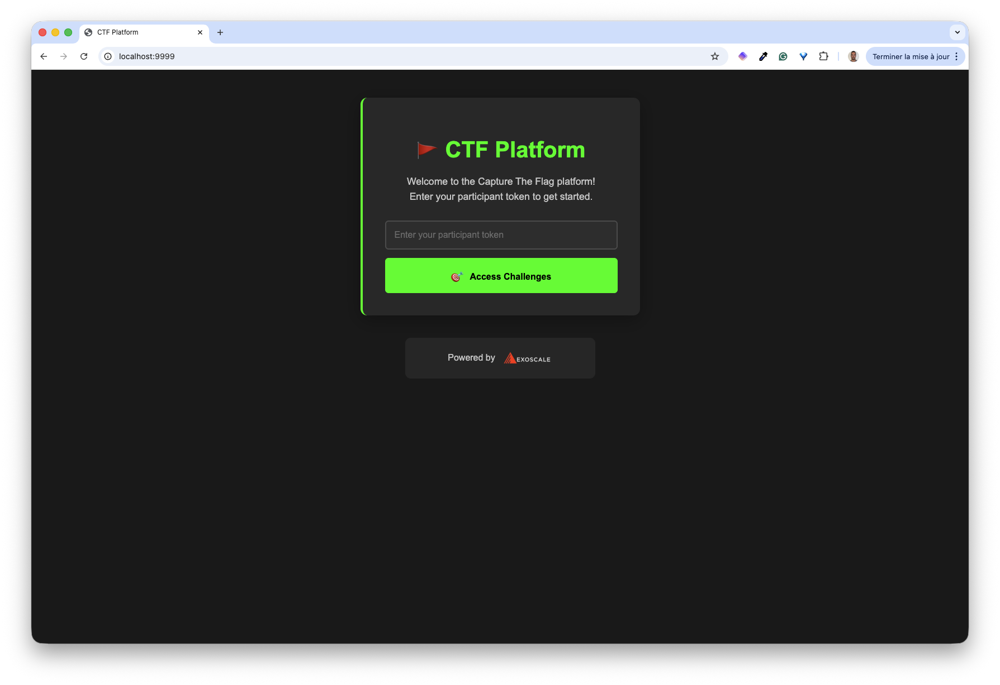
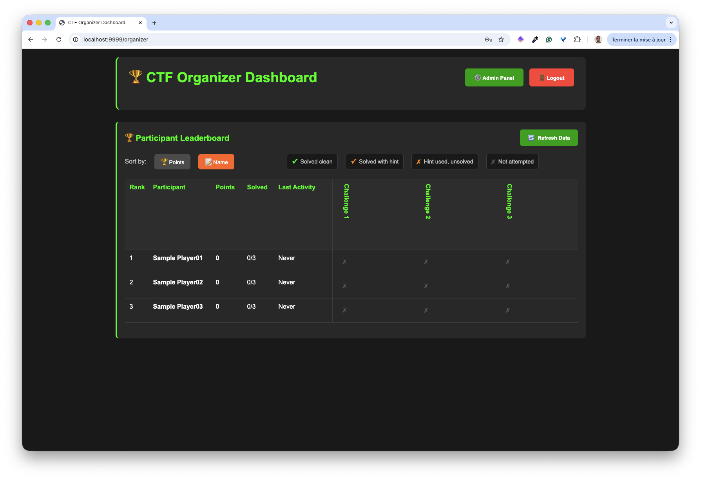
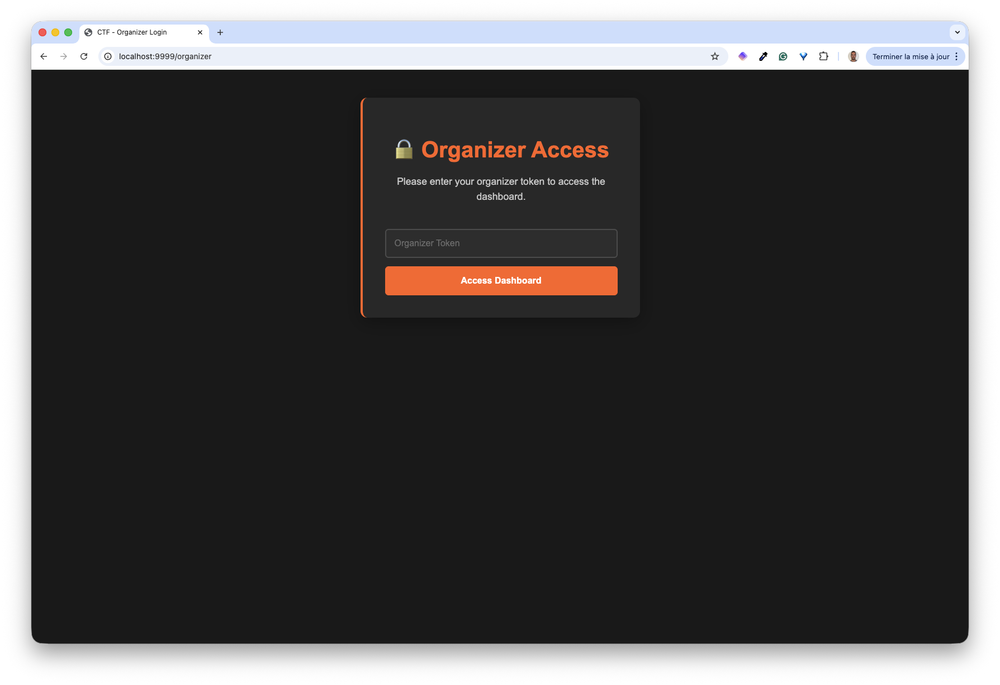
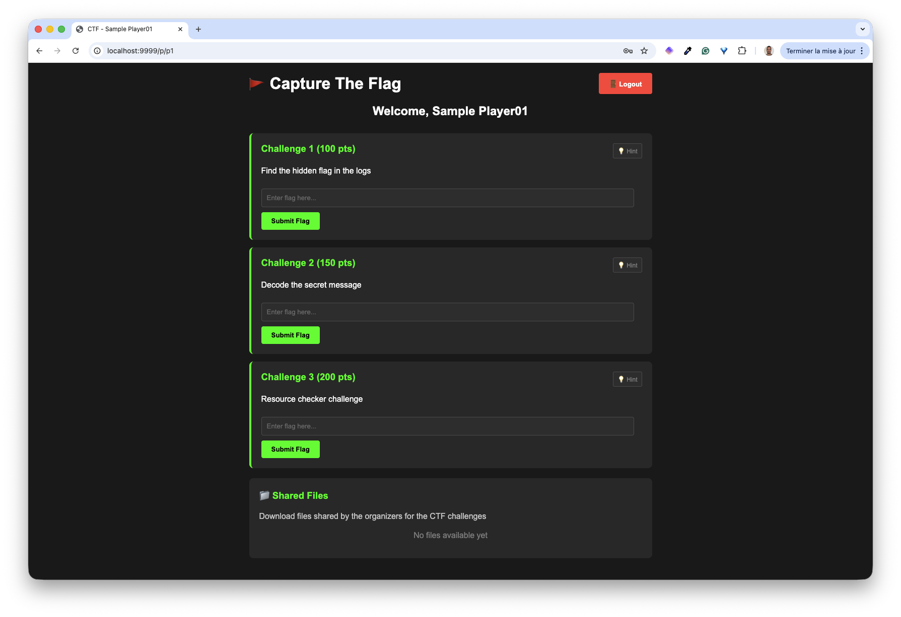

## Purpose

Web application to be used for CTF session. It provides a participant access to check the flags found, and an admin access to follow the leaderboard.

## Running it locally

```bash
docker compose up -d
```

## Participant access

Access this URL: [http://localhost:9999](http://localhost:9999)



Login with `p1`, `p2`or `p3` tokens.



## Administrator access

Access this URL: [http://localhost:9999/organizer](http://localhost:9999/organizer)



Login with `Admin`.



## Developer

```bash
docker compose up --watch
```